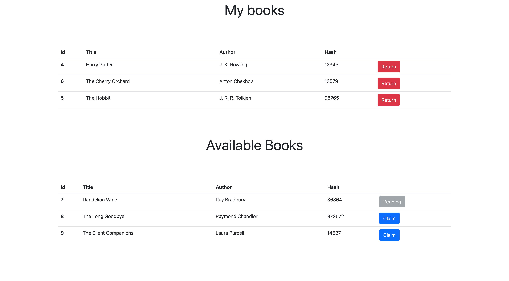
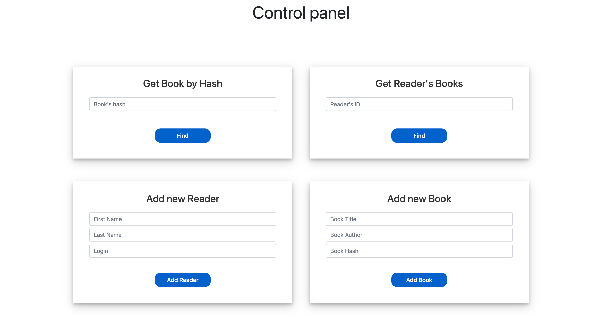

# Library Organizer

## Условия

В базе данных должны храниться сведения об имеющихся в библиотеке книгах и о читателях библиотеки.

Библиотекарю могут потребоваться следующие сведения:
- какие книги закреплены за читателем;
- кто автор и как называется книга с заданным шифром.

Библиотекарь может вносить следующие изменения:
- запись нового читателя в библиотеку;
- пополнение библиотеки;
- списывание старой книги;
- изменение шифра книги.

Дополнительно был реализован следующий функционал:
- авторизация в системе читателем или библиотекарем;
- отправка запроса на получение книги;
- обработка запросов на получение со стороны библиотекаря;
- возврат книги;
- просмотр собственных книг.

## Стэк технологий

### Бэкэнд
* Серверная сторона была реализована на языке Java с использованием фреймворка Spring. 
* В качестве базы данных
для удобства тестирования и разработки была выбрана SQL in-memory база данных H2. Гибкость фреймфорка Spring
позволяет без труда мигрировать на любую удобную базу данных для production среды.
* Для тестирования приложения была использована библиотека JUnit, а также фреймворк Mockito, Spring MockMVC.

### Фронтэнд
* В основу лег HTML и CSS.
* В качестве шаблонизатора странц был использован шаблонизатор Thymeleaf.
* Для удобства верстки и хорошего дизайна был использован CSS фреймворк Bootstrap.

## Описание решения
Клиентская сторона предствалена двумя основными страницами:

* Личный кабинет пользователя.
Здесь можно посмотреть какие книги сейчас закреплены за пользователем, вернуть имеющиеся или же запросить новые.



* Личный кабинет библиотекаря.
Здесь можно регистрировать читателей/добавлять новые книги и управлять существующими, а также получать статистику о читателях,
например, какая книга имеет искомый шифр, какие книги закреплены за читателем.




## Возможные улучшения
* Клиентская часть сейчас реализована без динамики. Использование связки JS + AJAX, переписывание на современные JS 
фреймворки (например React) улучшило бы польвательский опыт использования.
* Авторизация на данный момент достаточно примитивная. Авторизованный пользователь хранится в сессии. Хорошим решением было бы подключение OAuth2 авторизации,
использование Firebase.
* Необходимо API серверной стороны перевести на архитектурный стиль REST для удобства работы и версионирования.
* Рефакторинг кода.

## Запуск решения
Для запуска решения:
1. Склонируйте проект на свою систему.
2. Убедитесь в том что у вас загружены все зависимости в Maven.
3. Запустите в консоли в корне проекта: ```mvn spring-boot:run ```
